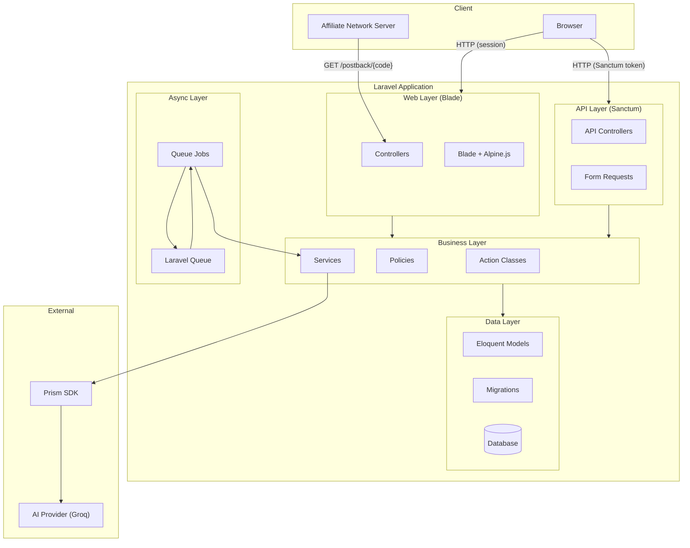
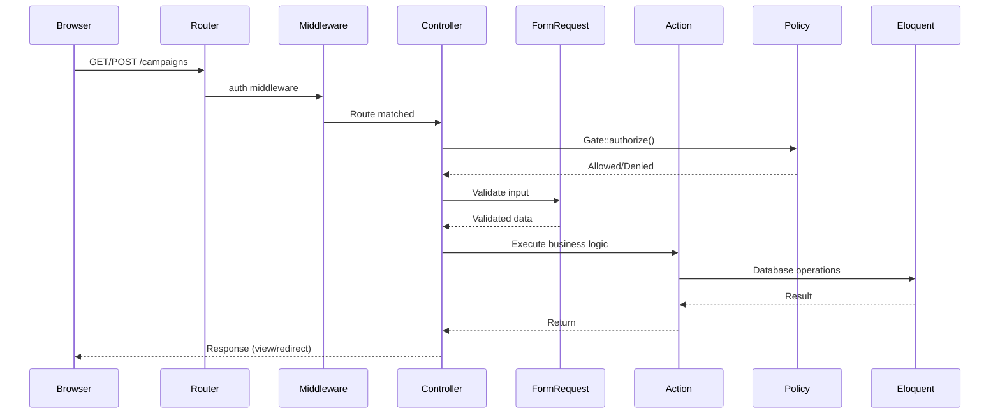
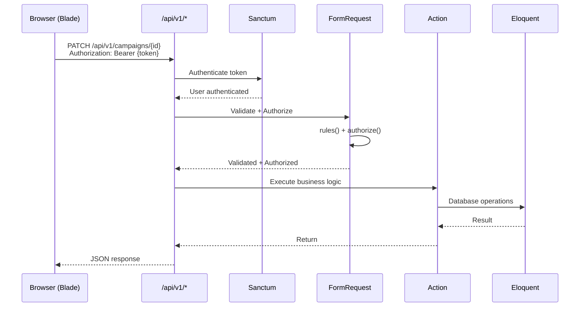
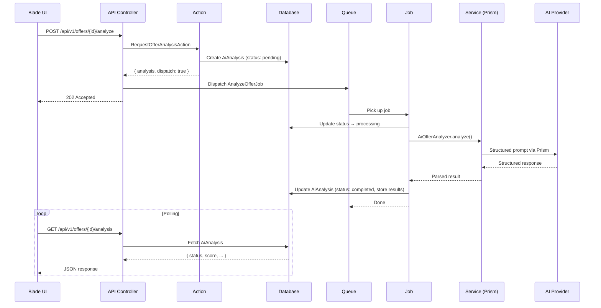
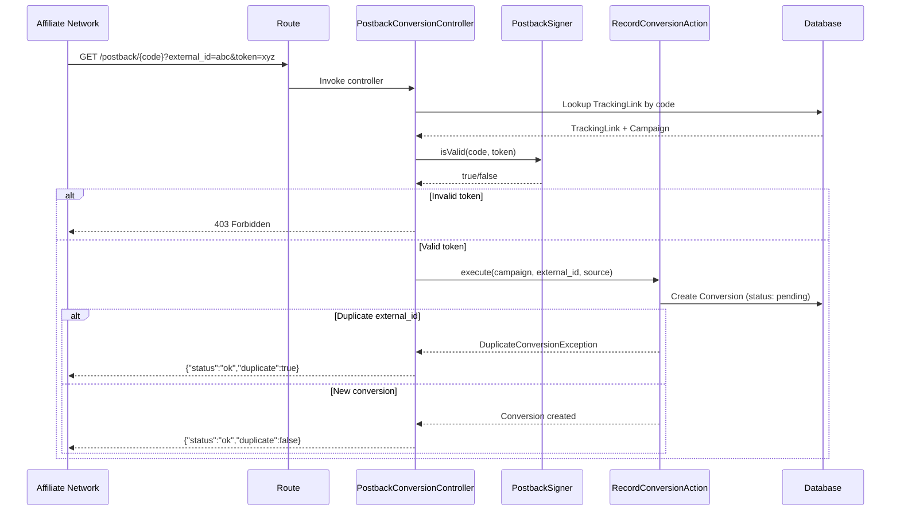
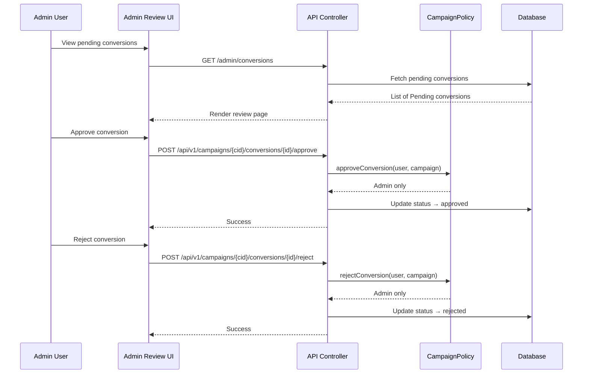
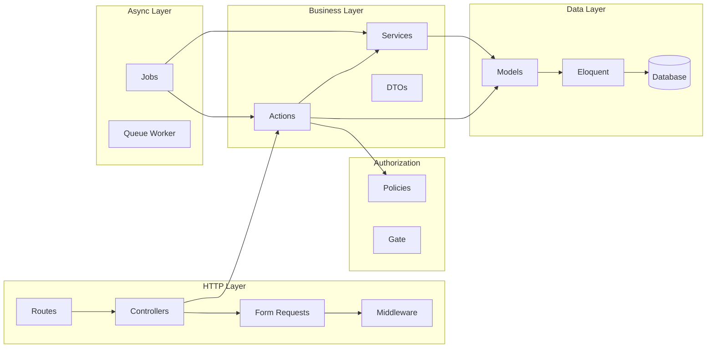
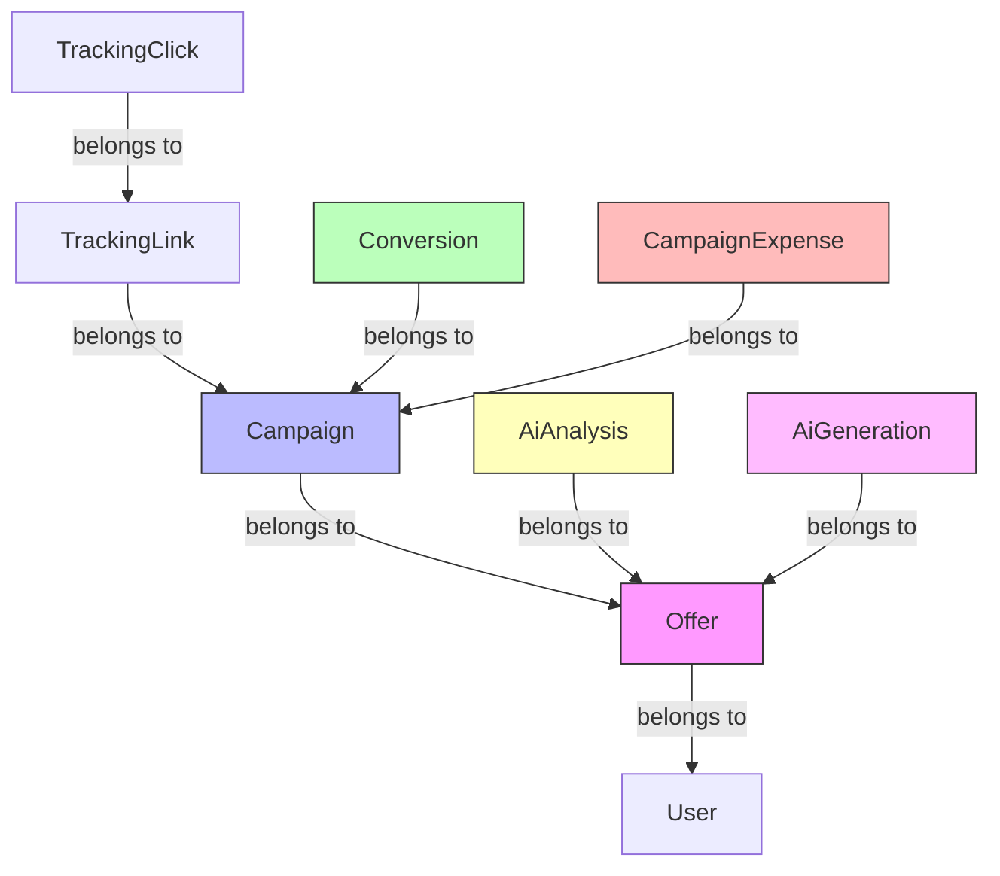

# Architecture

Technical architecture of CPAFlow AI.

## High-Level Application Architecture



## Laravel Request Lifecycle in This Project

### Web Flow (Blade)



### Authenticated API Flow



### AI Async Flow



### Conversion Postback Flow



### Conversion Admin Review Flow



## Layered Architecture



### Responsibility Matrix

| Component | What it does | What it does NOT do |
|-----------|-------------|-------------------|
| **Routes** | Maps URLs to controllers | Contains logic |
| **Controllers** | Coordinates HTTP request/response | Business logic, validation rules |
| **Form Requests** | Validates input, checks authorization | Database operations |
| **Actions** | Implements one business use case | HTTP concerns, validation |
| **Policies** | Answers "can this user do X?" | Performs the action |
| **Services** | Reusable technical logic (AI, signing, hashing) | Knows about HTTP |
| **Jobs** | Defers work to queue | Directly handles HTTP |
| **Models** | Relationships, scopes, casts | Business workflows |
| **DTOs** | Immutable data snapshots | Mutable state |

## Component Map

```
app/
├── Actions/
│   ├── Admin/                  # GetUserAction, ListUsersAction, UpdateUserRoleAction
│   ├── AiAnalysis/             # GetOfferAnalysisAction, RequestOfferAnalysisAction
│   ├── AiGeneration/           # GetGenerationAction, GetOfferGenerationsAction, RequestContentGenerationAction
│   ├── Auth/                   # AuthenticateApiUserAction
│   ├── Campaign/               # CreateCampaignAction, UpdateCampaignAction, ActivateCampaignAction, SuspendCampaignAction
│   ├── Conversion/             # RecordConversionAction
│   ├── Dashboard/              # GetDashboardStatisticsAction
│   ├── Offer/                  # CreateOfferAction, UpdateOfferAction, ArchiveOfferAction, RestoreOfferAction
│   └── TrackingLink/           # GenerateTrackingLinkAction, RecordTrackingClickAction
├── DTOs/                       # OfferAiInputSnapshot, OfferContentGenerationSnapshot, LoginResult, DashboardStatisticsPeriod
├── Enums/                      # UserRole, OfferStatus, CampaignStatus, ConversionStatus, AiProcessStatus
├── Exceptions/                 # DuplicateConversionException, InvalidCampaignTransition
├── Http/
│   ├── Controllers/
│   │   ├── Admin/              # ConversionReviewController
│   │   └── Api/V1/             # OfferController, CampaignController, ConversionController, ...
│   ├── Middleware/              # EnsureUserIsAdmin
│   └── Requests/               # Form Request classes
├── Jobs/                       # AnalyzeOfferJob, GenerateContentJob
├── Models/                     # User, Offer, Campaign, TrackingLink, TrackingClick, Conversion, CampaignExpense, AiAnalysis, AiGeneration
├── Policies/                   # OfferPolicy, CampaignPolicy, UserPolicy
└── Services/                   # PostbackSigner, AiOfferAnalyzer, AiContentGenerator, OfferInputHasher, GenerationInputHasher
                                    └── TrackingLink/ (IpHasher, TrackingCodeGenerator)
```

## Data Flow Summary


