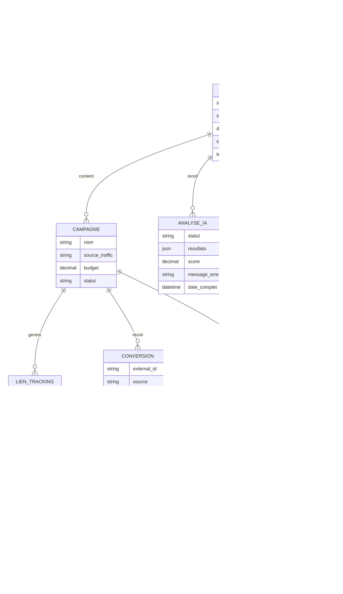
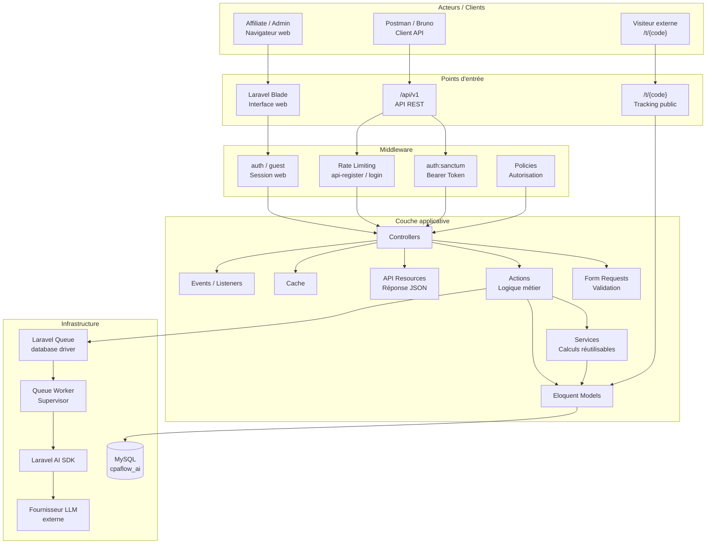
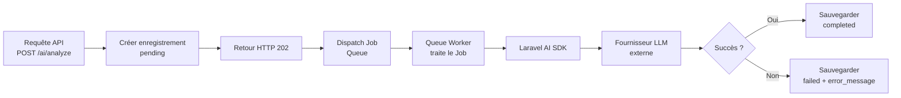
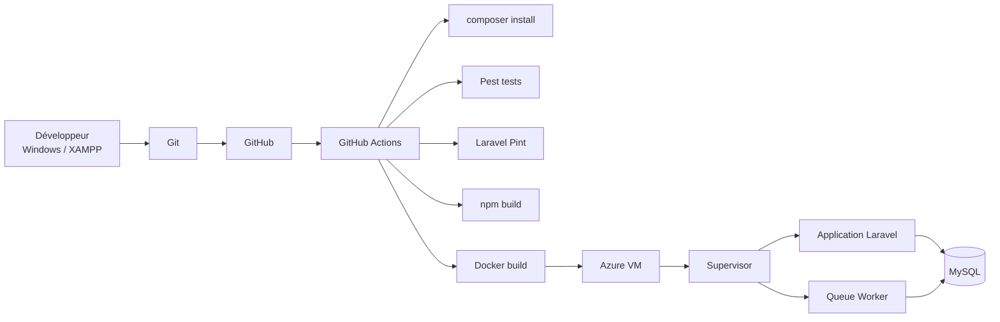

# Conception Technique — CPAFlow AI

> Dernière mise à jour : Août 2026
> Branche : `docs/project-design`
> Version du document : 1.0

---

## 1. Présentation du projet

**CPAFlow AI** est une application web de type SaaS destinée aux affiliés marketing. Elle permet à un Affiliate de :

- gérer des **offres CPA** (Cost Per Action) ;
- créer des **campagnes** liées à ces offres ;
- générer des **liens de tracking** uniques ;
- enregistrer des **clics** via les liens de tracking ;
- enregistrer des **conversions** (postback ou saisie manuelle) ;
- gérer les **dépenses** liées aux campagnes ;
- consulter des **statistiques de performance** ;
- analyser des offres avec l'aide de l'**IA** ;
- générer du **contenu marketing** (hooks, captions, calls-to-action) avec l'**IA**.

### Interfaces techniques principales

| Interface | Technologie |
|-----------|-------------|
| Interface web | Laravel Blade (Breeze) |
| API REST | `/api/v1` — JSON |
| Authentification API | Sanctum Bearer Token |
| Base de données | MySQL (`cpaflow_ai`) |
| Traitement asynchrone | Laravel Queue (database driver) |
| Intelligence artificielle | Laravel AI SDK + fournisseur LLM externe |
| Déploiement (cible) | Docker + Azure VM |

---

## 2. Légende du document

| Terme | Signification |
|-------|---------------|
| **Implémenté** | Fonctionnalité déjà codée, testée et disponible dans le code source actuel |
| **Planifié** | Fonctionnalité prévue dans le backlog mais pas encore codée |
| **À confirmer** | Décision de conception à valider lors de la User Story concernée |
| **Table technique Laravel** | Table créée par le framework pour infrastructure (cache, jobs, sessions, etc.) |
| **PK** | Primary Key — clé primaire |
| **FK** | Foreign Key — clé étrangère |
| **1,1** | Cardinalité obligatoire : exactement un |
| **0,N** | Cardinalité optionnelle : zéro ou plusieurs |
| **1,N** | Cardinalité obligatoire : au moins un |

---

## 3. MCD — Modèle Conceptuel de Données



### Règles métier principales

| # | Règle | Statut |
|---|-------|--------|
| R1 | Les données sont isolées par utilisateur authentifié — un Affiliate ne voit que ses propres offres, campagnes et statistiques. | Implémenté (Auth + API) |
| R2 | Une offre archivée ne peut pas être utilisée pour une nouvelle campagne. | Stratégie confirmée (KAN-12) — offres archivées avec statut `archived` |
| R3 | Une campagne suspendue ne peut pas générer un lien de tracking actif. | À confirmer dans l'OpenSpec de la User Story concernée |
| R4 | Le champ `external_id` sur les conversions empêche les doublons lors des postbacks. | Implémenté (KAN-16) — UNIQUE constraint + DuplicateConversionException |
| R5 | Les dépenses sont isolées par campagne et gérées en CRUD complet. | Implémenté (KAN-17) — nested-resource security, hard delete |
| R5 | Seules les conversions approuvées (`approved`) comptent dans le revenu. | Planifié |
| R6 | Le traitement IA utilise les statuts `pending`, `processing`, `completed`, `failed`. | Planifié |

---

## 4. MLD — Modèle Logique de Données

### Table `users` — Implémenté

```
id                 BIGINT          PK       auto_increment
name               VARCHAR(255)
email              VARCHAR(255)    UNIQUE
email_verified_at  TIMESTAMP       NULLABLE
password           VARCHAR(255)
remember_token     VARCHAR(100)    NULLABLE
role               VARCHAR(20)     DEFAULT 'affiliate'  INDEX
created_at         TIMESTAMP
updated_at         TIMESTAMP
```

### Table `offers` — Implémenté

```
id                 BIGINT          PK       auto_increment
user_id            BIGINT          FK -> users.id  ON DELETE CASCADE
name               VARCHAR(255)
destination_url    VARCHAR(2048)
payout             DECIMAL(12,2)   DEFAULT 0.00
status             VARCHAR(20)     DEFAULT 'draft'
description        TEXT            NULLABLE
created_at         TIMESTAMP
updated_at         TIMESTAMP

INDEX idx_offers_user_status (user_id, status)
```

- **Statut :** Implémenté (KAN-11) — Filtrage et archivage par statut implémentés (KAN-12)
- **Clé étrangère :** `user_id` → `users.id` avec suppression en cascade
- **Index composite :** `(user_id, status)` — utilisé pour le filtrage par statut (KAN-12)
- **Payout :** `DECIMAL(12,2)` — capacité maximale 9 999 999 999,99
- **Destination URL :** `VARCHAR(2048)` — supporte les URLs longues avec paramètres de requête

### Table `campaigns` — Implémenté

> Implémenté (KAN-13) — Migration `2026_07_23_140250_create_campaigns_table`.

```
id                 BIGINT UNSIGNED PK       auto_increment
offer_id           BIGINT UNSIGNED FK -> offers.id  ON DELETE CASCADE
name               VARCHAR(255)
traffic_source     VARCHAR(255)
budget             DECIMAL(12,2)
status             VARCHAR(20)     DEFAULT 'draft'
created_at         TIMESTAMP
updated_at         TIMESTAMP
```

- **Clé étrangère :** `offer_id` → `offers.id` avec suppression en cascade
- **Pas de user_id :** L'ownership est dérivée de `Campaign → Offer → User`
- **Budget :** `DECIMAL(12,2)` — capacité maximale 9 999 999 999,99
- **Statuts :** `draft`, `active`, `suspended` — lifecycle stricte
- **Pas de suppression ni d'archivage** de campagne dans KAN-13

### Table `tracking_links` — Implémenté (KAN-14)

> Implémenté (KAN-14) — Migration `2026_07_29_105824_create_tracking_links_table`.

```
id                 BIGINT UNSIGNED PK       auto_increment
campaign_id        BIGINT UNSIGNED FK -> campaigns.id  ON DELETE CASCADE
code               VARCHAR(32)     UNIQUE
created_at         TIMESTAMP
updated_at         TIMESTAMP
```

- **Clé étrangère :** `campaign_id` → `campaigns.id` avec suppression en cascade
- **Pas de user_id :** L'ownership est dérivée de `TrackingLink → Campaign → Offer → User`
- **Code :** `VARCHAR(32)` — caractère alphanumérique unique, généré par `Str::random(32)`
- **Pas de `is_active` :** Le statut est déterminé par le Campaign parent

### Table `tracking_clicks` — Implémenté (KAN-15)

> Implémenté (KAN-15) — Migration `2026_07_31_000000_create_tracking_clicks_table`.

```
id                 BIGINT UNSIGNED PK       auto_increment
tracking_link_id   BIGINT UNSIGNED FK -> tracking_links.id  ON DELETE CASCADE
ip_hash            VARCHAR(64)     NULLABLE
user_agent         VARCHAR(512)    NULLABLE
referer            VARCHAR(2048)   NULLABLE
utm_source         VARCHAR(255)    NULLABLE
utm_medium         VARCHAR(255)    NULLABLE
utm_campaign       VARCHAR(255)    NULLABLE
utm_term           VARCHAR(255)    NULLABLE
utm_content        VARCHAR(255)    NULLABLE
created_at         TIMESTAMP
updated_at         TIMESTAMP
```

- **Clé étrangère :** `tracking_link_id` → `tracking_links.id` avec suppression en cascade
- **Pas de user_id, offer_id, campaign_id :** L'ownership et la destination sont dérivées de `TrackingClick → TrackingLink → Campaign → Offer`
- **Pas de `clicked_at` :** `created_at` est l'horodatage autoritaire du clic
- **Pas de stockage d'IP brute :** Seul le hash HMAC-SHA256 est enregistré
- **Privacy IP :** Clé dérivée séparée par purpose (`tracking-ip-hash:v1` + `APP_KEY`), normalisation IPv4/IPv6 via `inet_pton`/`inet_ntop`
- **Métadonnées :** User-Agent (512), Referer (2048), chaque champ UTM (255) — trim, empty→null, tronquature `mb_substr`

### Table `conversions` — Implémenté (KAN-16)

> Implémenté (KAN-16) — Migration `2026_08_03_000000_create_conversions_table`.

```
id                 BIGINT UNSIGNED PK       auto_increment
campaign_id        BIGINT UNSIGNED FK -> campaigns.id  ON DELETE CASCADE
external_id        VARCHAR(255)    UNIQUE   NOT NULL
source             VARCHAR(255)    NULLABLE
revenue            DECIMAL(12,2)   NOT NULL
status             VARCHAR(20)     DEFAULT 'pending'  INDEX
converted_at       TIMESTAMP       NOT NULL
created_at         TIMESTAMP
updated_at         TIMESTAMP
```

- **Clé étrangère :** `campaign_id` → `campaigns.id` avec suppression en cascade
- **external_id :** `VARCHAR(255)`, NOT NULL, UNIQUE — identifiant transactionnel de l'annonceur
- **revenue :** `DECIMAL(12,2)` — snapshot côté serveur depuis `Offer.payout`, pas de DB default
- **converted_at :** `TIMESTAMP`, NOT NULL — généré côté serveur (`now()`), pas de DB default
- **status :** `VARCHAR(20)` — valeurs `pending`, `approved`, `rejected` via enum `ConversionStatus`
- **Pas de `tracking_link_id`, `tracking_click_id`, `offer_id`, `user_id`, `payout`**

### Table `campaign_expenses` — Implémenté (KAN-17)

> Implémenté (KAN-17) — Migration `2026_08_03_000001_create_campaign_expenses_table`.

```
id                 BIGINT UNSIGNED PK       auto_increment
campaign_id        BIGINT UNSIGNED FK -> campaigns.id  ON DELETE CASCADE
amount             DECIMAL(12,2)   NOT NULL
spent_at           DATE            NOT NULL
description        TEXT            NULLABLE
created_at         TIMESTAMP
updated_at         TIMESTAMP
```

- **Clé étrangère :** `campaign_id` → `campaigns.id` avec suppression en cascade
- **amount :** `DECIMAL(12,2)` — capacité maximale 9 999 999 999,99, pas de DB default
- **spent_at :** `DATE` — date de la dépense côté client, pas de DB default
- **description :** `TEXT` NULLABLE, trim + empty→null normalization
- **Pas de `user_id`, `offer_id`, `category`, `type`, `source`, `reference`, `status`, `deleted_at`**
- **Ownership :** dérivée de `CampaignExpense → Campaign → Offer → User`
- **Nested-resource security :** `$campaign->expenses()->findOrFail($expenseId)` — mismatch → 404

### Table `ai_analyses` — Planifié

> Planifié — à confirmer dans l'OpenSpec de la User Story concernée.

```
id                 BIGINT          PK       auto_increment
offer_id           BIGINT          FK -> offers.id
status             VARCHAR(20)     DEFAULT 'pending'  INDEX
resultats          JSON            NULLABLE
score              DECIMAL(5,2)    NULLABLE
error_message      TEXT            NULLABLE
completed_at       TIMESTAMP       NULLABLE
created_at         TIMESTAMP
updated_at         TIMESTAMP
```

### Table `ai_generations` — Planifié

> Planifié — à confirmer dans l'OpenSpec de la User Story concernée.

```
id                 BIGINT          PK       auto_increment
offer_id           BIGINT          FK -> offers.id
language           VARCHAR(10)     NULLABLE
tone               VARCHAR(50)     NULLABLE
platform           VARCHAR(50)     NULLABLE
hooks              JSON            NULLABLE
captions           JSON            NULLABLE
calls_to_action    JSON            NULLABLE
status             VARCHAR(20)     DEFAULT 'pending'  INDEX
error_message      TEXT            NULLABLE
completed_at       TIMESTAMP       NULLABLE
created_at         TIMESTAMP
updated_at         TIMESTAMP
```

### Tables techniques Laravel

> Ces tables sont créées et gérées par le framework Laravel. Elles ne font pas partie du MCD métier.

#### `personal_access_tokens` — Implémenté

```
id                 BIGINT          PK       auto_increment
tokenable_type     VARCHAR(255)
tokenable_id       BIGINT
name               VARCHAR(255)
token              VARCHAR(64)     UNIQUE
abilities          TEXT            NULLABLE
last_used_at       TIMESTAMP       NULLABLE
expires_at         TIMESTAMP       NULLABLE  INDEX
created_at         TIMESTAMP
updated_at         TIMESTAMP
```

#### `password_reset_tokens` — Implémenté

```
email              VARCHAR(255)    PK
token              VARCHAR(255)
created_at         TIMESTAMP       NULLABLE
```

#### `sessions` — Implémenté

```
id                 VARCHAR(255)    PK
user_id            BIGINT          NULLABLE  INDEX
ip_address         VARCHAR(45)     NULLABLE
user_agent         TEXT            NULLABLE
payload            LONGTEXT
last_activity      INT             INDEX
```

#### `cache` — Implémenté

```
key                VARCHAR(255)    PK
value              MEDIUMTEXT
expiration         BIGINT          INDEX
```

#### `cache_locks` — Implémenté

```
key                VARCHAR(255)    PK
owner              VARCHAR(255)
expiration         BIGINT          INDEX
```

#### `jobs` — Implémenté

```
id                 BIGINT          PK       auto_increment
queue              VARCHAR(255)    INDEX
payload            LONGTEXT
attempts           UNSIGNED SMALLINT
reserved_at        UNSIGNED INT    NULLABLE
available_at       UNSIGNED INT
created_at         UNSIGNED INT
```

#### `job_batches` — Implémenté

```
id                 VARCHAR(255)    PK
name               VARCHAR(255)
total_jobs         INT
pending_jobs       INT
failed_jobs        INT
failed_job_ids     LONGTEXT
options            MEDIUMTEXT      NULLABLE
cancelled_at       INT             NULLABLE
created_at         INT
finished_at        INT             NULLABLE
```

#### `failed_jobs` — Implémenté

```
id                 BIGINT          PK       auto_increment
uuid               VARCHAR(255)    UNIQUE
connection         VARCHAR(255)
queue              VARCHAR(255)
payload            LONGTEXT
exception          LONGTEXT
failed_at          TIMESTAMP       DEFAULT CURRENT_TIMESTAMP
```

---

## 5. Enums

### `UserRole` — Implémenté

| Valeur | Description |
|--------|-------------|
| `affiliate` | Rôle par défaut — utilisateur standard |
| `admin` | Administrateur |

- **Fichier :** `app/Enums/UserRole.php`
- **Statut :** Implémenté et utilisé (cast sur `User.role`)

### `OfferStatus` — Implémenté

| Valeur | Description |
|--------|-------------|
| `draft` | Brouillon |
| `active` | Active |
| `suspended` | Suspendue |
| `archived` | Archivée |

- **Fichier :** `app/Enums/OfferStatus.php`
- **Statut :** Implémenté et utilisé (cast sur `Offer.status`)

### `CampaignStatus` — Implémenté

| Valeur | Description |
|--------|-------------|
| `draft` | Brouillon — statut initial à la création |
| `active` | Active — après activation |
| `suspended` | Suspendue — après suspension |

- **Fichier :** `app/Enums/CampaignStatus.php`
- **Statut :** Implémenté et utilisé (cast sur `Campaign.status`, KAN-13)
- **Lifecycle :** `draft → active`, `active → suspended`, `suspended → active`
- **Transitions invalides :** retour `409 Conflict`, pas d'écriture en base

### `ConversionStatus` — Créé, pas encore utilisé

| Valeur | Description |
|--------|-------------|
| `pending` | En attente de validation |
| `approved` | Approuvée — compte dans le revenu |
| `rejected` | Rejetée |

- **Fichier :** `app/Enums/ConversionStatus.php`
- **Statut :** Créé (KAN-8) mais pas encore lié à une migration ou un modèle

### `AiProcessStatus` — Créé, pas encore utilisé

| Valeur | Description |
|--------|-------------|
| `pending` | En attente de traitement |
| `processing` | En cours de traitement |
| `completed` | Traitement terminé avec succès |
| `failed` | Échec du traitement |

- **Fichier :** `app/Enums/AiProcessStatus.php`
- **Statut :** Créé (KAN-8) mais pas encore lié à une migration ou un modèle

---

## 6. Architecture applicative



### Interface Web — Implémentée (KAN-31)

- **Technologie :** Laravel Blade + Tailwind CSS + Alpine.js
- **Authentification :** Session Laravel (driver `database`)
- **Scaffolding :** Laravel Breeze (Blade)
- **Design system :** Palette `brand` (50–900), ombres `card`/`card-hover` dans `tailwind.config.js`
- **Composants Blade réutilisables :** `page-header`, `status-badge`, `flash-message`, `empty-state`, `confirm-button`, `search-input`, `tracking-url`, `form-group`
- **Protection :** CSRF (`@csrf`), middleware `auth`, `verified`
- **Réutilisation :** Les Form Requests API (`StoreOfferRequest`, `UpdateOfferRequest`, `StoreCampaignRequest`, `UpdateCampaignRequest`) sont réutilisées directement par les Controllers web — pas de duplication de logique
- **Policies :** Mêmes Policies que l'API (`OfferPolicy`, `CampaignPolicy`, `TrackingLinkPolicy`) — autorisation par ownership
- **Actions :** Mêmes Actions que l'API — pas de logique métier dupliquée dans les Controllers web
- **Responsive :** Layout adaptatif — tableau sur desktop, cards sur mobile, menu hamburger
- **Pages :** login, register, dashboard (overview), offers (CRUD + archive), campaigns (CRUD + lifecycle + tracking links), profil
- **Routes web :**
  - `GET /dashboard` — tableau de bord avec compteurs et données récentes
  - `GET /offers` — liste paginée avec recherche et filtre par statut
  - `GET /offers/create` — formulaire de création
  - `POST /offers` — création (via `StoreOfferRequest`)
  - `GET /offers/{offer}/edit` — formulaire d'édition
  - `PATCH /offers/{offer}` — mise à jour (via `UpdateOfferRequest`)
  - `POST /offers/{offer}/archive` — archivage (via `ArchiveOfferAction`)
  - `GET /campaigns` — liste paginée avec badges de statut
  - `GET /campaigns/create` — formulaire avec dropdown offers
  - `POST /campaigns` — création (via `StoreCampaignRequest`)
  - `GET /campaigns/{campaign}` — détail avec section tracking links
  - `GET /campaigns/{campaign}/edit` — formulaire d'édition
  - `PATCH /campaigns/{campaign}` — mise à jour (via `UpdateCampaignRequest`)
  - `POST /campaigns/{campaign}/activate` — activation (via `ActivateCampaignAction`)
  - `POST /campaigns/{campaign}/suspend` — suspension (via `SuspendCampaignAction`)
  - `POST /campaigns/{campaign}/tracking-links` — génération lien (via `GenerateTrackingLinkAction`)
  - `GET /t/{code}` — redirection tracking publique (KAN-15)

### API REST

- **Préfixe :** `/api/v1`
- **Format :** JSON
- **Authentification :** Sanctum Bearer Token (`Authorization: Bearer {token}`)
- **Versioning :** Prefix `/v1` dans `routes/api.php`
- **Routes actuelles :**
  - `GET /api/v1/health` — public
  - `POST /api/v1/auth/register` — public, throttle `api-register`
  - `POST /api/v1/auth/login` — public, rate limiting dans l'Action
  - `POST /api/v1/auth/logout` — authentifié
  - `GET /api/v1/auth/user` — authentifié
  - `PATCH /api/v1/profile` — authentifié
  - `GET /api/v1/offers` — authentifié, liste paginée des offres (filtrage par statut, recherche par nom)
  - `POST /api/v1/offers` — authentifié, création d'offre
  - `PATCH /api/v1/offers/{offer}` — authentifié, mise à jour partielle d'offre (propriétaire uniquement)
  - `POST /api/v1/offers/{offer}/archive` — authentifié, archivage d'offre (propriétaire uniquement)
  - `GET /api/v1/campaigns` — authentifié, liste paginée des campagnes (15 par page, isolation par ownership Offer)
  - `POST /api/v1/campaigns` — authentifié, création de campagne (draft uniquement, offre non archivée requise)
  - `GET /api/v1/campaigns/{campaign}` — authentifié, détail d'une campagne (propriétaire uniquement)
  - `PATCH /api/v1/campaigns/{campaign}` — authentifié, mise à jour partielle (name, traffic_source, budget uniquement)
  - `POST /api/v1/campaigns/{campaign}/activate` — authentifié, activation (draft/suspended → active)
  - `POST /api/v1/campaigns/{campaign}/suspend` — authentifié, suspension (active → suspended)
  - `POST /api/v1/campaigns/{campaign}/tracking-links` — authentifié, génération de lien de tracking (KAN-14)
  - `POST /api/v1/campaigns/{campaign}/conversions` — authentifié, enregistrement conversion sans doublon (KAN-16)
  - `GET /api/v1/campaigns/{campaign}/expenses` — authentifié, liste paginée des dépenses (KAN-17)
  - `POST /api/v1/campaigns/{campaign}/expenses` — authentifié, création de dépense (KAN-17)
  - `PATCH /api/v1/campaigns/{campaign}/expenses/{expense}` — authentifié, mise à jour partielle dépense (KAN-17)
  - `DELETE /api/v1/campaigns/{campaign}/expenses/{expense}` — authentifié, suppression dépense (KAN-17)
  - `GET /api/v1/dashboard/statistics` — authentifié, statistiques agrégées du dashboard (KAN-18)

### Routes web — Implémentées (KAN-31)

> Implémenté (KAN-31) — Routes dans `routes/web.php`, middleware `auth`.

- `GET /dashboard` — `DashboardController@index` — nom `dashboard`, middleware `auth`, `verified`
- `GET /offers` — `OfferController@index` — liste paginée, recherche, filtre statut
- `GET /offers/create` — `OfferController@create` — formulaire création
- `POST /offers` — `OfferController@store` — via `StoreOfferRequest` (réutilisée depuis l'API)
- `GET /offers/{offer}/edit` — `OfferController@edit` — formulaire édition
- `PATCH /offers/{offer}` — `OfferController@update` — via `UpdateOfferRequest` (réutilisée depuis l'API)
- `POST /offers/{offer}/archive` — `OfferController@archive` — via `ArchiveOfferAction`
- `GET /campaigns` — `CampaignController@index` — liste paginée, eager-load offer
- `GET /campaigns/create` — `CampaignController@create` — formulaire avec dropdown offers non archivées
- `POST /campaigns` — `CampaignController@store` — via `StoreCampaignRequest` (réutilisée)
- `GET /campaigns/{campaign}` — `CampaignController@show` — détail + tracking links
- `GET /campaigns/{campaign}/edit` — `CampaignController@edit` — formulaire édition
- `PATCH /campaigns/{campaign}` — `CampaignController@update` — via `UpdateCampaignRequest` (réutilisée)
- `POST /campaigns/{campaign}/activate` — `CampaignController@activate` — via `ActivateCampaignAction`
- `POST /campaigns/{campaign}/suspend` — `CampaignController@suspend` — via `SuspendCampaignAction`
- `POST /campaigns/{campaign}/tracking-links` — `CampaignController@storeTrackingLink` — via `GenerateTrackingLinkAction`

### Couche métier

- **Controllers :** Restreints à la coordination HTTP (entrée/sortie)
- **Form Requests :** Validation de l'input avant traitement
- **Actions :** Un cas métier par classe (`RegisterUserAction`, `AuthenticateApiUserAction`)
- **Services :** Logique réutilisable (pas encore de services créés)
- **API Resources :** Structuration des réponses JSON (`UserResource`)
- **Enums :** Prévention des valeurs de statut invalides
- **Modèles Eloquent :** ORM avec casts typés

### Tracking public — Implémenté (KAN-15)

> Implémenté (KAN-15) — Route `GET /t/{code}` dans `routes/web.php`.

- **Route :** `GET /t/{code}` — nom `tracking.redirect`, pas d'authentification, pas de middleware `auth:sanctum`
- **Controller :** `RedirectTrackingLinkController` (invokable, single-action)
- **Action :** `RecordTrackingClickAction` — enregistre le clic via `$trackingLink->clicks()->create()`
- **Service :** `IpHasher` — hash HMAC-SHA256 avec clé séparée par purpose
- **Logique :**
  1. Chercher le lien de tracking par `code` avec eager-loading `campaign.offer`
  2. Vérifier que `Campaign` et `Offer` existent
  3. Vérifier que `Campaign.status === Active`
  4. Vérifier la sécurité de l'URL de destination (`filter_var(FILTER_VALIDATE_URL)` + scheme http/https + host non vide)
  5. Enregistrer le clic dans un try-catch (échec = `report()` + redirect quand même)
  6. Rediriger 302 vers `Offer.destination_url`
- **Scénarios :**
  - Code inconnu → 404
  - Campagne draft → 404
  - Campagne suspendue → 404
  - URL de destination non sécurisée → 404
  - Campagne active + destination sûre → 302

### Traitement IA asynchrone

> Planifié — à confirmer dans l'OpenSpec de la User Story concernée.



---

## 7. Architecture de déploiement



### Développement local

| Composant | Technologie |
|-----------|-------------|
| Système d'exploitation | Windows |
| Serveur local | XAMPP |
| PHP | 8.3+ |
| Gestionnaire de dépendances | Composer 2.9+ |
| Base de données | MySQL (`cpaflow_ai`) |
| Runtime JavaScript | Node.js |
| Gestionnaire de paquets JS | npm |

### Tests

| Outil | Rôle |
|-------|------|
| Pest | Framework de tests (syntaxe expressive) |
| SQLite in-memory | Base de données de test (pas de MySQL) |
| Laravel Pint | Vérification du style de code |
| `npm run build` | Vérification du build frontend |

### Production cible

| Composant | Technologie | Statut |
|-----------|-------------|--------|
| Serveur | Azure VM | Planifié |
| Conteneurisation | Docker / Docker Compose | Planifié |
| Gestion de processus | Supervisor | Planifié |
| Queue Worker | `php artisan queue:work` via Supervisor | Planifié |
| Variables d'environnement | `.env` avec variables production | Planifié |
| Sécurité CI/CD | GitHub Secrets | Planifié |
| Mode debug | `APP_DEBUG=false` | Planifié |

---

## 8. Conventions d'architecture

| Règle | Description |
|-------|-------------|
| Controllers restreints | Un controller ne contient que la coordination HTTP (entrée/sortie). Pas de logique métier. |
| Form Requests pour la validation | Chaque input public est validé via un Form Request dédié. |
| Policies et Middleware pour l'autorisation | L'accès aux ressources est contrôlé par des Policies ou des Middleware. |
| Actions = un cas métier par classe | Chaque Action encapsule un seul use case métier. |
| Services = logique réutilisable | Les calculs et intégrations externes mutualisées vont dans des Services. |
| API Resources pour les réponses JSON | Toute réponse API publique passe par un Resource. |
| Enums pour les statuts | Les colonnes de statut utilisent des Enums string-backed pour garantir l'intégrité. |
| Contraintes base de données | Les index, uniques et contraintes FK protègent l'intégrité au niveau BDD. |
| Routes privées = auth:sanctum | Toute route API nécessitant un utilisateur authentifié utilise le middleware `auth:sanctum`. |
| Isolation par utilisateur | Les données sont toujours filtrées par l'utilisateur authentifié (pas d'accès inter-utilisateurs). |
| Tests = SQLite in-memory | Les tests ne modifient jamais la base MySQL locale. |
| Secrets jamais commités | `APP_KEY`, mots de passe, Bearer Tokens, `.env` ne sont jamais versionnés. |

---

## 9. État actuel du projet

### Implémenté

| Fonctionnalité | Détail |
|----------------|--------|
| Fondation Laravel | Laravel 13.8, PHP 8.3+, structure standard |
| Connexion MySQL | Base `cpaflow_ai`, migrations exécutées |
| Routes API versionnées | `/api/v1` avec préfixe dans `routes/api.php` |
| Endpoint santé | `GET /api/v1/health` — retourne JSON avec statut, service, version, timestamp |
| Laravel Breeze Blade | Insallé — vues auth (login, register, forgot-password, reset-password, confirm-password, verify-email), profil, dashboard |
| Laravel Sanctum | Installé — token Bearer, migration `personal_access_tokens` |
| Inscription et connexion | Web (Breeze) + API (`/api/v1/auth/register`, `/api/v1/auth/login`) |
| Déconnexion | Web (Breeze) + API (`/api/v1/auth/logout` — révoque le token courant uniquement) |
| Rôle Affiliate/Admin | Enum `UserRole`, colonne `role` (VARCHAR(20), default `affiliate`, indexée) |
| Authentification API token | Sanctum `auth:sanctum`, `HasApiTokens` sur User |
| Rate limiting inscription API | Limiter `api-register` : 10/min par IP |
| Rate limiting connexion API | Lifecycle explicite dans `AuthenticateApiUserAction` : 5/min par email\|IP |
| Form Requests API | `RegisterApiRequest`, `LoginApiRequest` |
| API Resource utilisateur | `UserResource` : id, name, email, role |
| DTO Login | `LoginResult` : success/failed/throttled |
| Actions | `RegisterUserAction` (partagé web+API), `AuthenticateApiUserAction` |
| Pest | Configuré, `RefreshDatabase` sur Feature tests |
| Laravel Pint | Conforme |
| Build frontend | `npm run build` via Vite + Tailwind CSS |
| Tests | 190/190 tests passent |
| Profil API update | `PATCH /api/v1/profile` — mise à jour du profil utilisateur |
| Middleware admin | `EnsureUserIsAdmin` — protection des routes admin |
| Offres (create + list) | Table `offers`, modèle `Offer`, `POST /api/v1/offers`, `GET /api/v1/offers` |
| Offres (update + archive) | `PATCH /api/v1/offers/{offer}`, `POST /api/v1/offers/{offer}/archive` — KAN-12 |
| Offres (filtrage + recherche) | `GET /api/v1/offers?status=&search=` — scopes `scopeStatus`, `scopeSearch` |
| OfferPolicy | Autorisation par ownership — `update()`, `archive()` |
| CreateOfferAction | Logique métier centralisée pour la création d'offres |
| UpdateOfferAction | Logique métier centralisée pour la mise à jour d'offres |
| ArchiveOfferAction | Logique métier centralisée pour l'archivage d'offres |
| StoreOfferRequest | Validation de la création d'offres avec `url:http,https` et `decimal:0,2` |
| UpdateOfferRequest | Validation partielle avec `sometimes`, normalisation, vérification d'ownership |
| IndexOfferRequest | Validation du filtrage par statut et recherche par nom |
| OfferResource | Structure JSON pour les offres |
| OfferFactory | Génération de données de test pour les offres |
| Campagnes (CRUD + lifecycle) | Table `campaigns`, modèle `Campaign`, 6 routes API — KAN-13 |
| CampaignStatus lifecycle | `draft → active → suspended → active`, transitions strictes, `409` sur invalides |
| CampaignPolicy | Autorisation par ownership dérivée (`Campaign → Offer → User`) |
| CreateCampaignAction | Création draft systématique via relation Offer |
| UpdateCampaignAction | Mise à jour partielle (name, traffic_source, budget) |
| ActivateCampaignAction | Activation draft/suspended → active |
| SuspendCampaignAction | Suspension active → suspended |
| InvalidCampaignTransition | Exception domain → 409 JSON |
| StoreCampaignRequest | Validation création avec résolution Offer, archived Offer 422, status prohibited |
| UpdateCampaignRequest | PATCH partiel, prohibited fields (offer_id, user_id, status) |
| CampaignResource | JSON : id, offer {id, name}, name, traffic_source, budget, status, timestamps |
| CampaignFactory | Offres par défaut, states active/suspended, budget DECIMAL(12,2) |
| TrackingLink (génération) | Table `tracking_links`, modèle `TrackingLink`, `POST /api/v1/campaigns/{id}/tracking-links` — KAN-14 |
| GenerateTrackingLinkAction | Génération de code unique 32 caractères alphanumériques |
| TrackingLinkPolicy | Autorisation par ownership dérivée (`TrackingLink → Campaign → Offer → User`) |
| TrackingClick (clic + redirect) | Table `tracking_clicks`, modèle `TrackingClick`, `GET /t/{code}` — KAN-15 |
| RecordTrackingClickAction | Enregistrement du clic avec hash IP, métadonnées tronquées |
| IpHasher | HMAC-SHA256, clé séparée par purpose, normalisation IPv4/IPv6 |
| RedirectTrackingLinkController | Route publique 302, try-catch sur persistance, vérification URL sûre |
| Conversion (enregistrement) | Table `conversions`, modèle `Conversion`, `POST /api/v1/campaigns/{id}/conversions` — KAN-16 |
| RecordConversionAction | Enregistrement conversion avec snapshot revenue, détection doublon hardenée |
| DuplicateConversionException | Exception domain → 409 JSON pour `external_id` en doublon |
| StoreConversionRequest | Validation `external_id` requis + `source` optionnel, pas de rule `unique` |
| ConversionResource | JSON : id, campaign_id, external_id, source, revenue, status, converted_at, timestamps |
| ConversionFactory | Defaults valides, states forCampaign |
| Campaign Expenses (CRUD) | Table `campaign_expenses`, modèle `CampaignExpense`, 4 routes API — KAN-17 |
| RecordCampaignExpenseAction | Enregistrement dépense via `$campaign->expenses()->create()` |
| UpdateCampaignExpenseAction | Mise à jour partielle dépense |
| DeleteCampaignExpenseAction | Suppression dépense (hard delete) |
| StoreCampaignExpenseRequest | Validation amount (required, numeric, gt:0, decimal:0,2, max:9999999999.99), spent_at (required, date, before_or_equal:today), description (nullable, max:10000) |
| UpdateCampaignExpenseRequest | PATCH partiel avec rules sometimes |
| CampaignExpenseResource | JSON : id, campaign_id, amount (2-decimal string), spent_at (YYYY-MM-DD), description, timestamps |
| CampaignExpenseFactory | Defaults valides (positive amount, past/today date), states forCampaign |
| CampaignPolicy (expenses) | viewExpenses, recordExpense, updateExpense, deleteExpense — nested-resource security (404 for foreign) |
| Interface web Blade (KAN-31) | Dashboard, Offers CRUD+archive, Campaigns CRUD+lifecycle+tracking links |
| Design system | Palette `brand`, ombres `card`/`card-hover`, composants Blade réutilisables |
| Web Controllers | `DashboardController`, `OfferController`, `CampaignController` |
| Réutilisation API | Form Requests, Actions, Policies de l'API réutilisées directement |
| Tests web (KAN-31) | `OfferWebTest`, `CampaignWebTest`, `ProfileWebTest`, `N1QueryTest` |

### Planifié

| Fonctionnalité | Statut |
|----------------|--------|
| Offres (delete physique) | Pas encore défini |
| Campagnes (CRUD) | Implémenté (KAN-13) — CRUD + lifecycle sans delete/archive |
| TrackingLink (génération) | Implémenté (KAN-14) — `POST /api/v1/campaigns/{id}/tracking-links` |
| TrackingClick (clic + redirect) | Implémenté (KAN-15) — `GET /t/{code}` — 302, enregistrement clic, privacy IP |
| Conversions (enregistrement) | Implémenté (KAN-16) — `POST /api/v1/campaigns/{id}/conversions` — sans doublon |
| Dépenses campagne | Implémenté (KAN-17) — CRUD complet — `GET/POST/PATCH/DELETE /api/v1/campaigns/{id}/expenses` |
| Dashboard statistiques | Implémenté (KAN-18) — `GET /api/v1/dashboard/statistics` — agrégats all-time |
| Analyse IA | Table `ai_analyses` planifiée, pas de Job |
| Génération IA | Table `ai_generations` planifiée, pas de Job |
| Docker | Pas de `Dockerfile` ni `docker-compose.yml` |
| CI/CD | Pas de pipeline GitHub Actions |
| Déploiement Azure | Pas de configuration Azure |

---

## 10. Points à confirmer

| # | Décision | User Story concernée |
|---|----------|----------------------|
| 1 | Colonnes définitives de la table `offers` (champs optionnels, contraintes) | Confirmé (KAN-11 + KAN-12) |
| 2 | Stratégie d'archivage des offres (soft delete vs. statut `archived`) | Confirmé (KAN-12) — statut `archived`, pas de SoftDeletes |
| 3 | Contraintes de suppression (que se passe-t-il quand on supprime une offre avec des campagnes ?) | Offres |
| 4 | Précision monétaire exacte (DECIMAL(10,2) vs. DECIMAL(12,4) pour les montants) | Offres, Campagnes, Conversions |
| 5 | Relation exacte entre conversions et clics (liées par `tracking_link_id` ? par `external_id` ?) | Conversions |
| 6 | Expiration des liens de tracking (durée de vie, régénération) | Tracking |
| 7 | Expiration des tokens Sanctum (config `sanctum.expiration`) | Auth |
| 8 | Stratégie de cache du dashboard (quelle clé, quelle durée, invalidation) | Dashboard |
| 9 | Fournisseur IA (OpenAI, Anthropic, autre) | IA |
| 10 | Schéma de sortie structuré pour les résultats IA (JSON attendu par le frontend) | IA |
| 11 | Topologie Docker (un seul conteneur vs. multi-conteneur, nginx séparé ?) | Déploiement |
| 12 | Configuration Azure (taille VM, base de données managée vs. installée, réseau) | Déploiement |
