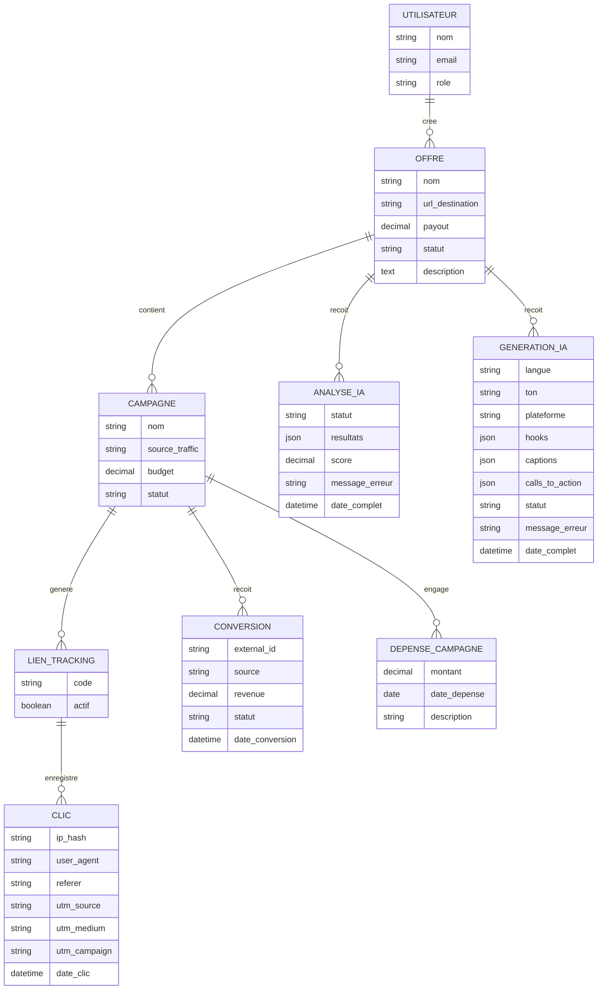
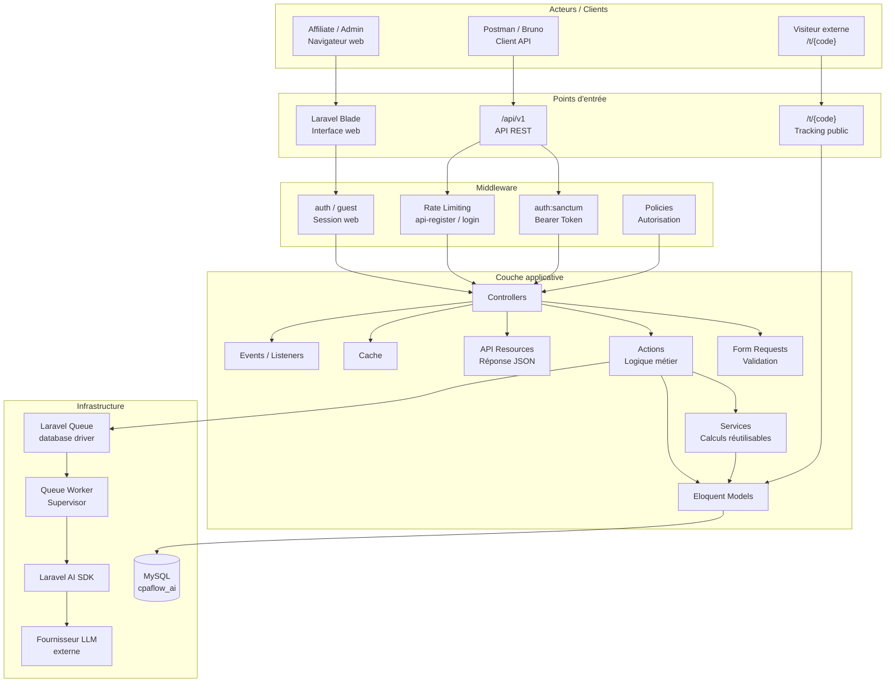
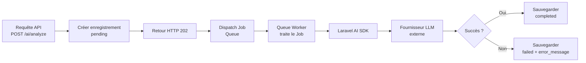
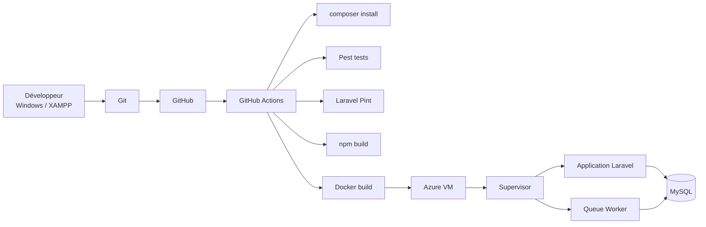

# Conception Technique — CPAFlow AI

> Dernière mise à jour : Juillet 2026
> Branche : `docs/project-design`
> Version du document : 1.0

---

## 1. Présentation du projet

**CPAFlow AI** est une application web de type SaaS destinée aux affiliés marketing. Elle permet à un Affiliate de :

- gérer des **offres CPA** (Cost Per Action) ;
- créer des **campagnes** liées à ces offres ;
- générer des **liens de tracking** uniques ;
- enregistrer des **clics** via les liens de tracking ;
- enregistrer des **conversions** (postback ou saisie manuelle) ;
- gérer les **dépenses** liées aux campagnes ;
- consulter des **statistiques de performance** ;
- analyser des offres avec l'aide de l'**IA** ;
- générer du **contenu marketing** (hooks, captions, calls-to-action) avec l'**IA**.

### Interfaces techniques principales

| Interface | Technologie |
|-----------|-------------|
| Interface web | Laravel Blade (Breeze) |
| API REST | `/api/v1` — JSON |
| Authentification API | Sanctum Bearer Token |
| Base de données | MySQL (`cpaflow_ai`) |
| Traitement asynchrone | Laravel Queue (database driver) |
| Intelligence artificielle | Laravel AI SDK + fournisseur LLM externe |
| Déploiement (cible) | Docker + Azure VM |

---

## 2. Légende du document

| Terme | Signification |
|-------|---------------|
| **Implémenté** | Fonctionnalité déjà codée, testée et disponible dans le code source actuel |
| **Planifié** | Fonctionnalité prévue dans le backlog mais pas encore codée |
| **À confirmer** | Décision de conception à valider lors de la User Story concernée |
| **Table technique Laravel** | Table créée par le framework pour infrastructure (cache, jobs, sessions, etc.) |
| **PK** | Primary Key — clé primaire |
| **FK** | Foreign Key — clé étrangère |
| **1,1** | Cardinalité obligatoire : exactement un |
| **0,N** | Cardinalité optionnelle : zéro ou plusieurs |
| **1,N** | Cardinalité obligatoire : au moins un |

---

## 3. MCD — Modèle Conceptuel de Données



### Règles métier principales

| # | Règle | Statut |
|---|-------|--------|
| R1 | Les données sont isolées par utilisateur authentifié — un Affiliate ne voit que ses propres offres, campagnes et statistiques. | Implémenté (Auth + API) |
| R2 | Une offre archivée ne peut pas être utilisée pour une nouvelle campagne. | À confirmer dans l'OpenSpec de la User Story concernée |
| R3 | Une campagne suspendue ne peut pas générer un lien de tracking actif. | À confirmer dans l'OpenSpec de la User Story concernée |
| R4 | Le champ `external_id` sur les conversions empêche les doublons lors des postbacks. | Planifié |
| R5 | Seules les conversions approuvées (`approved`) comptent dans le revenu. | Planifié |
| R6 | Le traitement IA utilise les statuts `pending`, `processing`, `completed`, `failed`. | Planifié |

---

## 4. MLD — Modèle Logique de Données

### Table `users` — Implémenté

```
id                 BIGINT          PK       auto_increment
name               VARCHAR(255)
email              VARCHAR(255)    UNIQUE
email_verified_at  TIMESTAMP       NULLABLE
password           VARCHAR(255)
remember_token     VARCHAR(100)    NULLABLE
role               VARCHAR(20)     DEFAULT 'affiliate'  INDEX
created_at         TIMESTAMP
updated_at         TIMESTAMP
```

### Table `offers` — Planifié

> Planifié — à confirmer dans l'OpenSpec de la User Story concernée.

```
id                 BIGINT          PK       auto_increment
user_id            BIGINT          FK -> users.id
name               VARCHAR(255)
destination_url    TEXT
payout             DECIMAL(10,2)
status             VARCHAR(20)     DEFAULT 'draft'  INDEX
description        TEXT            NULLABLE
created_at         TIMESTAMP
updated_at         TIMESTAMP
```

### Table `campaigns` — Planifié

> Planifié — à confirmer dans l'OpenSpec de la User Story concernée.

```
id                 BIGINT          PK       auto_increment
offer_id           BIGINT          FK -> offers.id
name               VARCHAR(255)
traffic_source     VARCHAR(255)    NULLABLE
budget             DECIMAL(10,2)   NULLABLE
status             VARCHAR(20)     DEFAULT 'draft'  INDEX
created_at         TIMESTAMP
updated_at         TIMESTAMP
```

### Table `tracking_links` — Planifié

> Planifié — à confirmer dans l'OpenSpec de la User Story concernée.

```
id                 BIGINT          PK       auto_increment
campaign_id        BIGINT          FK -> campaigns.id
code               VARCHAR(32)     UNIQUE
is_active          BOOLEAN         DEFAULT true
created_at         TIMESTAMP
updated_at         TIMESTAMP
```

### Table `clicks` — Planifié

> Planifié — à confirmer dans l'OpenSpec de la User Story concernée.

```
id                 BIGINT          PK       auto_increment
tracking_link_id   BIGINT          FK -> tracking_links.id
ip_hash            VARCHAR(64)
user_agent         TEXT            NULLABLE
referer            TEXT            NULLABLE
utm_source         VARCHAR(255)    NULLABLE
utm_medium         VARCHAR(255)    NULLABLE
utm_campaign       VARCHAR(255)    NULLABLE
clicked_at         TIMESTAMP
created_at         TIMESTAMP
updated_at         TIMESTAMP
```

### Table `conversions` — Planifié

> Planifié — à confirmer dans l'OpenSpec de la User Story concernée.

```
id                 BIGINT          PK       auto_increment
campaign_id        BIGINT          FK -> campaigns.id
external_id        VARCHAR(255)    UNIQUE  NULLABLE
source             VARCHAR(255)    NULLABLE
revenue            DECIMAL(10,2)
status             VARCHAR(20)     DEFAULT 'pending'  INDEX
converted_at       TIMESTAMP
created_at         TIMESTAMP
updated_at         TIMESTAMP
```

### Table `campaign_expenses` — Planifié

> Planifié — à confirmer dans l'OpenSpec de la User Story concernée.

```
id                 BIGINT          PK       auto_increment
campaign_id        BIGINT          FK -> campaigns.id
amount             DECIMAL(10,2)
spent_at           DATE
description        TEXT            NULLABLE
created_at         TIMESTAMP
updated_at         TIMESTAMP
```

### Table `ai_analyses` — Planifié

> Planifié — à confirmer dans l'OpenSpec de la User Story concernée.

```
id                 BIGINT          PK       auto_increment
offer_id           BIGINT          FK -> offers.id
status             VARCHAR(20)     DEFAULT 'pending'  INDEX
resultats          JSON            NULLABLE
score              DECIMAL(5,2)    NULLABLE
error_message      TEXT            NULLABLE
completed_at       TIMESTAMP       NULLABLE
created_at         TIMESTAMP
updated_at         TIMESTAMP
```

### Table `ai_generations` — Planifié

> Planifié — à confirmer dans l'OpenSpec de la User Story concernée.

```
id                 BIGINT          PK       auto_increment
offer_id           BIGINT          FK -> offers.id
language           VARCHAR(10)     NULLABLE
tone               VARCHAR(50)     NULLABLE
platform           VARCHAR(50)     NULLABLE
hooks              JSON            NULLABLE
captions           JSON            NULLABLE
calls_to_action    JSON            NULLABLE
status             VARCHAR(20)     DEFAULT 'pending'  INDEX
error_message      TEXT            NULLABLE
completed_at       TIMESTAMP       NULLABLE
created_at         TIMESTAMP
updated_at         TIMESTAMP
```

### Tables techniques Laravel

> Ces tables sont créées et gérées par le framework Laravel. Elles ne font pas partie du MCD métier.

#### `personal_access_tokens` — Implémenté

```
id                 BIGINT          PK       auto_increment
tokenable_type     VARCHAR(255)
tokenable_id       BIGINT
name               VARCHAR(255)
token              VARCHAR(64)     UNIQUE
abilities          TEXT            NULLABLE
last_used_at       TIMESTAMP       NULLABLE
expires_at         TIMESTAMP       NULLABLE  INDEX
created_at         TIMESTAMP
updated_at         TIMESTAMP
```

#### `password_reset_tokens` — Implémenté

```
email              VARCHAR(255)    PK
token              VARCHAR(255)
created_at         TIMESTAMP       NULLABLE
```

#### `sessions` — Implémenté

```
id                 VARCHAR(255)    PK
user_id            BIGINT          NULLABLE  INDEX
ip_address         VARCHAR(45)     NULLABLE
user_agent         TEXT            NULLABLE
payload            LONGTEXT
last_activity      INT             INDEX
```

#### `cache` — Implémenté

```
key                VARCHAR(255)    PK
value              MEDIUMTEXT
expiration         BIGINT          INDEX
```

#### `cache_locks` — Implémenté

```
key                VARCHAR(255)    PK
owner              VARCHAR(255)
expiration         BIGINT          INDEX
```

#### `jobs` — Implémenté

```
id                 BIGINT          PK       auto_increment
queue              VARCHAR(255)    INDEX
payload            LONGTEXT
attempts           UNSIGNED SMALLINT
reserved_at        UNSIGNED INT    NULLABLE
available_at       UNSIGNED INT
created_at         UNSIGNED INT
```

#### `job_batches` — Implémenté

```
id                 VARCHAR(255)    PK
name               VARCHAR(255)
total_jobs         INT
pending_jobs       INT
failed_jobs        INT
failed_job_ids     LONGTEXT
options            MEDIUMTEXT      NULLABLE
cancelled_at       INT             NULLABLE
created_at         INT
finished_at        INT             NULLABLE
```

#### `failed_jobs` — Implémenté

```
id                 BIGINT          PK       auto_increment
uuid               VARCHAR(255)    UNIQUE
connection         VARCHAR(255)
queue              VARCHAR(255)
payload            LONGTEXT
exception          LONGTEXT
failed_at          TIMESTAMP       DEFAULT CURRENT_TIMESTAMP
```

---

## 5. Enums

### `UserRole` — Implémenté

| Valeur | Description |
|--------|-------------|
| `affiliate` | Rôle par défaut — utilisateur standard |
| `admin` | Administrateur |

- **Fichier :** `app/Enums/UserRole.php`
- **Statut :** Implémenté et utilisé (cast sur `User.role`)

### `OfferStatus` — Créé, pas encore utilisé

| Valeur | Description |
|--------|-------------|
| `draft` | Brouillon |
| `active` | Active |
| `suspended` | Suspendue |
| `archived` | Archivée |

- **Fichier :** `app/Enums/OfferStatus.php`
- **Statut :** Créé (KAN-8) mais pas encore lié à une migration ou un modèle

### `CampaignStatus` — Créé, pas encore utilisé

| Valeur | Description |
|--------|-------------|
| `draft` | Brouillon |
| `active` | Active |
| `suspended` | Suspendue |

- **Fichier :** `app/Enums/CampaignStatus.php`
- **Statut :** Créé (KAN-8) mais pas encore lié à une migration ou un modèle

### `ConversionStatus` — Créé, pas encore utilisé

| Valeur | Description |
|--------|-------------|
| `pending` | En attente de validation |
| `approved` | Approuvée — compte dans le revenu |
| `rejected` | Rejetée |

- **Fichier :** `app/Enums/ConversionStatus.php`
- **Statut :** Créé (KAN-8) mais pas encore lié à une migration ou un modèle

### `AiProcessStatus` — Créé, pas encore utilisé

| Valeur | Description |
|--------|-------------|
| `pending` | En attente de traitement |
| `processing` | En cours de traitement |
| `completed` | Traitement terminé avec succès |
| `failed` | Échec du traitement |

- **Fichier :** `app/Enums/AiProcessStatus.php`
- **Statut :** Créé (KAN-8) mais pas encore lié à une migration ou un modèle

---

## 6. Architecture applicative



### Interface Web

- **Technologie :** Laravel Blade avec Tailwind CSS
- **Authentification :** Session Laravel (driver `database`)
- **Scaffolding :** Laravel Breeze (Blade)
- **Pages :** login, register, dashboard, profil, mot de passe oublié, réinitialisation, vérification email
- **Protection :** CSRF (`@csrf`), middleware `auth`, `guest`

### API REST

- **Préfixe :** `/api/v1`
- **Format :** JSON
- **Authentification :** Sanctum Bearer Token (`Authorization: Bearer {token}`)
- **Versioning :** Prefix `/v1` dans `routes/api.php`
- **Routes actuelles :**
  - `GET /api/v1/health` — public
  - `POST /api/v1/auth/register` — public, throttle `api-register`
  - `POST /api/v1/auth/login` — public, rate limiting dans l'Action
  - `POST /api/v1/auth/logout` — authentifié
  - `GET /api/v1/auth/user` — authentifié

### Couche métier

- **Controllers :** Restreints à la coordination HTTP (entrée/sortie)
- **Form Requests :** Validation de l'input avant traitement
- **Actions :** Un cas métier par classe (`RegisterUserAction`, `AuthenticateApiUserAction`)
- **Services :** Logique réutilisable (pas encore de services créés)
- **API Resources :** Structuration des réponses JSON (`UserResource`)
- **Enums :** Prévention des valeurs de statut invalides
- **Modèles Eloquent :** ORM avec casts typés

### Tracking public

> Planifié — à confirmer dans l'OpenSpec de la User Story concernée.

- **Route :** `GET /t/{code}` — public, pas d'authentification
- **Logique :**
  1. Chercher le lien de tracking par `code`
  2. Vérifier `is_active`
  3. Enregistrer le clic (ip_hash, user_agent, referer, UTM)
  4. Rediriger vers `destination_url` de l'offre

### Traitement IA asynchrone

> Planifié — à confirmer dans l'OpenSpec de la User Story concernée.



---

## 7. Architecture de déploiement



### Développement local

| Composant | Technologie |
|-----------|-------------|
| Système d'exploitation | Windows |
| Serveur local | XAMPP |
| PHP | 8.3+ |
| Gestionnaire de dépendances | Composer 2.9+ |
| Base de données | MySQL (`cpaflow_ai`) |
| Runtime JavaScript | Node.js |
| Gestionnaire de paquets JS | npm |

### Tests

| Outil | Rôle |
|-------|------|
| Pest | Framework de tests (syntaxe expressive) |
| SQLite in-memory | Base de données de test (pas de MySQL) |
| Laravel Pint | Vérification du style de code |
| `npm run build` | Vérification du build frontend |

### Production cible

| Composant | Technologie | Statut |
|-----------|-------------|--------|
| Serveur | Azure VM | Planifié |
| Conteneurisation | Docker / Docker Compose | Planifié |
| Gestion de processus | Supervisor | Planifié |
| Queue Worker | `php artisan queue:work` via Supervisor | Planifié |
| Variables d'environnement | `.env` avec variables production | Planifié |
| Sécurité CI/CD | GitHub Secrets | Planifié |
| Mode debug | `APP_DEBUG=false` | Planifié |

---

## 8. Conventions d'architecture

| Règle | Description |
|-------|-------------|
| Controllers restreints | Un controller ne contient que la coordination HTTP (entrée/sortie). Pas de logique métier. |
| Form Requests pour la validation | Chaque input public est validé via un Form Request dédié. |
| Policies et Middleware pour l'autorisation | L'accès aux ressources est contrôlé par des Policies ou des Middleware. |
| Actions = un cas métier par classe | Chaque Action encapsule un seul use case métier. |
| Services = logique réutilisable | Les calculs et intégrations externes mutualisées vont dans des Services. |
| API Resources pour les réponses JSON | Toute réponse API publique passe par un Resource. |
| Enums pour les statuts | Les colonnes de statut utilisent des Enums string-backed pour garantir l'intégrité. |
| Contraintes base de données | Les index, uniques et contraintes FK protègent l'intégrité au niveau BDD. |
| Routes privées = auth:sanctum | Toute route API nécessitant un utilisateur authentifié utilise le middleware `auth:sanctum`. |
| Isolation par utilisateur | Les données sont toujours filtrées par l'utilisateur authentifié (pas d'accès inter-utilisateurs). |
| Tests = SQLite in-memory | Les tests ne modifient jamais la base MySQL locale. |
| Secrets jamais commités | `APP_KEY`, mots de passe, Bearer Tokens, `.env` ne sont jamais versionnés. |

---

## 9. État actuel du projet

### Implémenté

| Fonctionnalité | Détail |
|----------------|--------|
| Fondation Laravel | Laravel 13.8, PHP 8.3+, structure standard |
| Connexion MySQL | Base `cpaflow_ai`, migrations exécutées |
| Routes API versionnées | `/api/v1` avec préfixe dans `routes/api.php` |
| Endpoint santé | `GET /api/v1/health` — retourne JSON avec statut, service, version, timestamp |
| Laravel Breeze Blade | Insallé — vues auth (login, register, forgot-password, reset-password, confirm-password, verify-email), profil, dashboard |
| Laravel Sanctum | Installé — token Bearer, migration `personal_access_tokens` |
| Inscription et connexion | Web (Breeze) + API (`/api/v1/auth/register`, `/api/v1/auth/login`) |
| Déconnexion | Web (Breeze) + API (`/api/v1/auth/logout` — révoque le token courant uniquement) |
| Rôle Affiliate/Admin | Enum `UserRole`, colonne `role` (VARCHAR(20), default `affiliate`, indexée) |
| Authentification API token | Sanctum `auth:sanctum`, `HasApiTokens` sur User |
| Rate limiting inscription API | Limiter `api-register` : 10/min par IP |
| Rate limiting connexion API | Lifecycle explicite dans `AuthenticateApiUserAction` : 5/min par email|IP |
| Form Requests API | `RegisterApiRequest`, `LoginApiRequest` |
| API Resource utilisateur | `UserResource` : id, name, email, role |
| DTO Login | `LoginResult` : success/failed/throttled |
| Actions | `RegisterUserAction` (partagé web+API), `AuthenticateApiUserAction` |
| Pest | Configuré, `RefreshDatabase` sur Feature tests |
| Laravel Pint | Conforme |
| Build frontend | `npm run build` via Vite + Tailwind CSS |
| Tests | 57/57 tests passent |

### Planifié

| Fonctionnalité | Statut |
|----------------|--------|
| Profil API update | Pas encore d'endpoint API pour mettre à jour le profil |
| Middleware admin | Pas de middleware `admin` pour les routes protégées |
| Offres (CRUD) | Table `offers` planifiée, pas de migration |
| Campagnes (CRUD) | Table `campaigns` planifiée, pas de migration |
| Tracking (génération + clics) | Tables `tracking_links` et `clicks` planifiées |
| Conversions (postback) | Table `conversions` planifiée |
| Dépenses campagne | Table `campaign_expenses` planifiée |
| Dashboard statistiques | Pas encore de route ni de vue |
| Analyse IA | Table `ai_analyses` planifiée, pas de Job |
| Génération IA | Table `ai_generations` planifiée, pas de Job |
| Docker | Pas de `Dockerfile` ni `docker-compose.yml` |
| CI/CD | Pas de pipeline GitHub Actions |
| Déploiement Azure | Pas de configuration Azure |

---

## 10. Points à confirmer

| # | Décision | User Story concernée |
|---|----------|----------------------|
| 1 | Colonnes définitives de la table `offers` (champs optionnels, contraintes) | Offres |
| 2 | Stratégie d'archivage des offres (soft delete vs. statut `archived`) | Offres |
| 3 | Contraintes de suppression (que se passe-t-il quand on supprime une offre avec des campagnes ?) | Offres |
| 4 | Précision monétaire exacte (DECIMAL(10,2) vs. DECIMAL(12,4) pour les montants) | Offres, Campagnes, Conversions |
| 5 | Relation exacte entre conversions et clics (liées par `tracking_link_id` ? par `external_id` ?) | Conversions |
| 6 | Expiration des liens de tracking (durée de vie, régénération) | Tracking |
| 7 | Expiration des tokens Sanctum (config `sanctum.expiration`) | Auth |
| 8 | Stratégie de cache du dashboard (quelle clé, quelle durée, invalidation) | Dashboard |
| 9 | Fournisseur IA (OpenAI, Anthropic, autre) | IA |
| 10 | Schéma de sortie structuré pour les résultats IA (JSON attendu par le frontend) | IA |
| 11 | Topologie Docker (un seul conteneur vs. multi-conteneur, nginx séparé ?) | Déploiement |
| 12 | Configuration Azure (taille VM, base de données managée vs. installée, réseau) | Déploiement |
